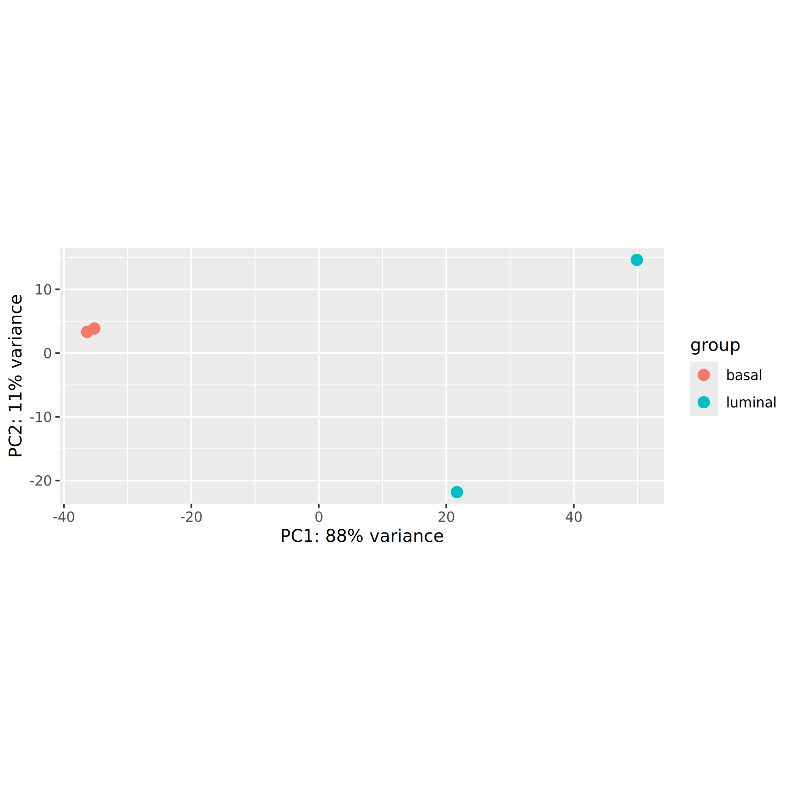
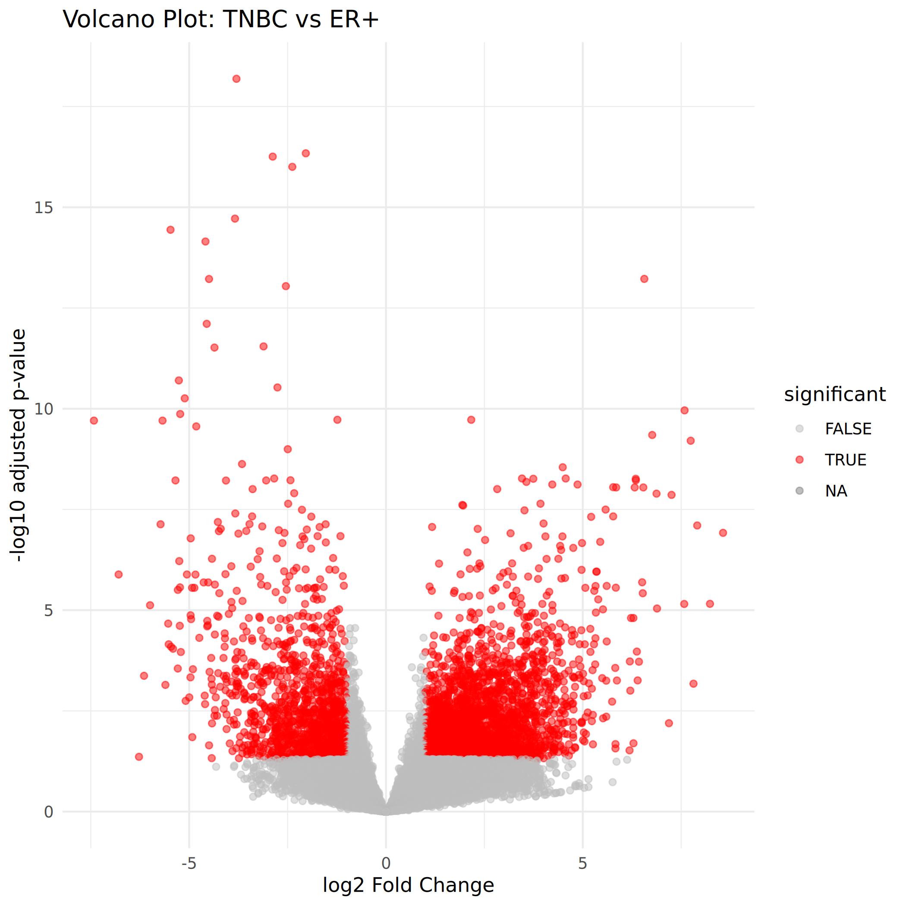
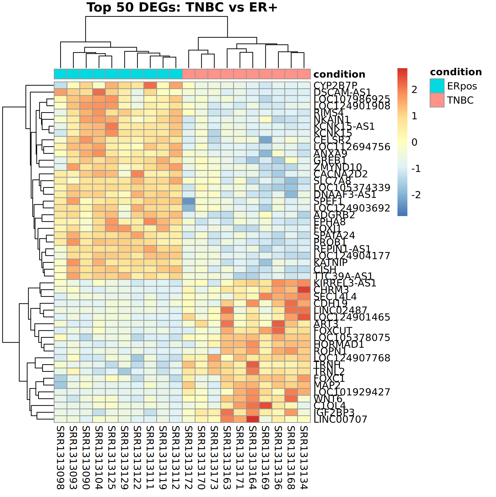
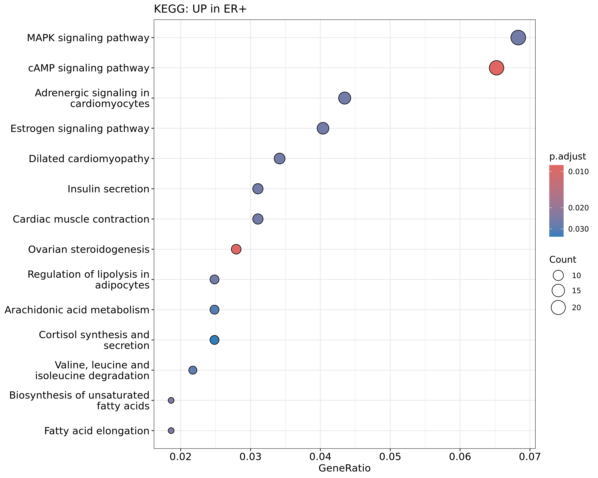
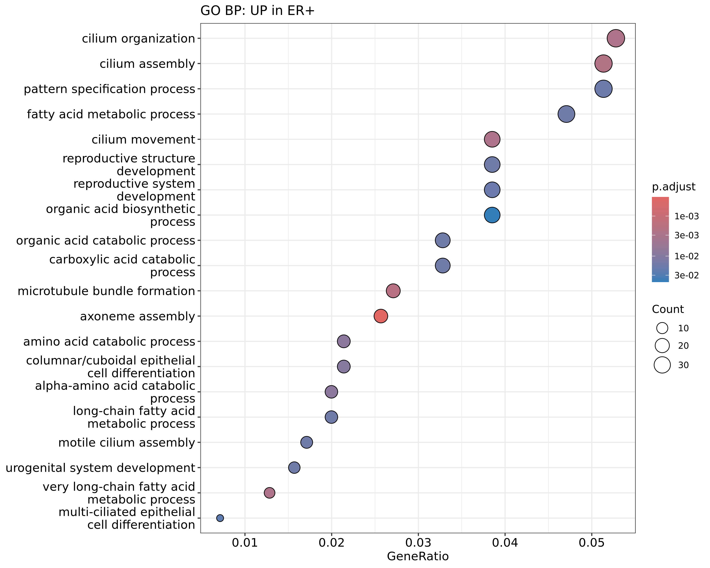
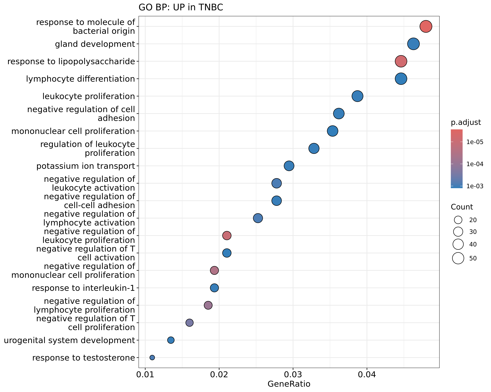
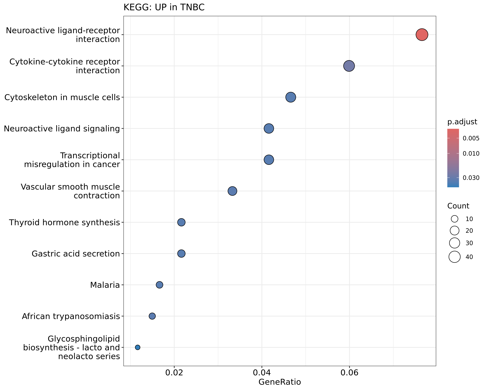

# Differential Gene Expression Analysis of Breast Cancer Subtypes Using RNA-seq

**A Reproducible Snakemake Pipeline with DESeq2 and Pathway Enrichment**

This project implements a complete, reproducible RNA-seq differential expression
workflow comparing two clinically distinct breast cancer subtypes — Triple-Negative
Breast Cancer (TNBC) and Estrogen-Receptor-Positive (ER+) — from raw sequencing
reads through to differentially expressed genes and biological pathway enrichment.

The pipeline was validated in two phases: a mouse mammary dataset with a known
published result (Phase 1), followed by a human breast cancer dataset in the latter phase.
This README documents the human analysis.

---

## Biological Background

Breast cancer is not a single disease but a collection of molecularly distinct
subtypes that differ in biology, treatment, and prognosis. Two of the most
clinically important are:

**ER+ (Estrogen-Receptor-Positive)** tumors express the estrogen receptor (encoded
by *ESR1*) and depend on estrogen signaling for growth. They are treated with
endocrine therapy (e.g. tamoxifen, aromatase inhibitors) and generally carry a
favorable prognosis.

**TNBC (Triple-Negative Breast Cancer)** lacks estrogen receptor, progesterone
receptor, and HER2 amplification. With no receptor to target, TNBC has no approved
endocrine or anti-HER2 therapy, grows aggressively, and carries the worst prognosis
of the major subtypes. It is, however, the most immunogenic subtype and is treated
with immune checkpoint inhibitors (e.g. pembrolizumab).

The goal of this analysis is to recover these known biological differences directly
from RNA-seq data, confirming that the pipeline produces biologically meaningful
results.

---

## Dataset

| Property | Value |
|---|---|
| Study | GSE58135 (Varley et al., 2014) |
| SRA accession | SRP042620 |
| Platform | Illumina HiSeq 2000 |
| Library | Paired-end, reverse-stranded |
| Samples used | 10 TNBC + 10 ER+ = 20 |
| Reference genome | hg38 (UCSC) |
| Annotation | UCSC ncbiRefSeq GTF |

Samples were selected from the study's SRA Run Selector metadata. A key practical
lesson encoded in this project: raw FASTQ availability must be verified in the SRA
Run Selector before committing to a dataset — a candidate dataset (GSE96058 / SCAN-B)
was abandoned because its raw reads were only available under EGA controlled access.

---

## Pipeline Overview

```
FASTQ (SRA)
   |  fasterq-dump
   v
Raw reads ----- FastQC ---+
   |  Trim Galore         |
   v                      |
Trimmed reads             |
   |  STAR (hg38 index)   |
   v                      +--> MultiQC (aggregate QC)
Aligned BAM --------------+
   |  featureCounts (-s 2, paired)
   v
Count matrix
   |  DESeq2
   v
Differential expression --> PCA, volcano, heatmap
   |  clusterProfiler
   v
GO + KEGG pathway enrichment
```

The entire workflow is orchestrated by **Snakemake**, which manages dependencies,
parallelism, and automatic deletion of large intermediate files (`temp()`) to
control disk usage.

### Tools

| Step | Tool |
|---|---|
| Download | sra-tools (`fasterq-dump`) |
| QC | FastQC, MultiQC |
| Trimming | Trim Galore (paired mode) |
| Alignment | STAR 2.7.11b |
| Quantification | featureCounts (subread) |
| Differential expression | DESeq2 (R/Bioconductor) |
| Pathway enrichment | clusterProfiler, org.Hs.eg.db |
| Orchestration | Snakemake |
| Compute | AWS EC2 (r5.2xlarge), Ubuntu |

---

## Methods

**Quantification strategy.** Reads were quantified against gene models with
`featureCounts` in paired-end mode (`-p --countReadPairs`) using reverse-strand
counting (`-s 2`), matching the library chemistry of this dataset.

**Differential expression.** Raw counts were modeled in DESeq2 with the design
`~ condition`. ER+ was set as the reference level via `relevel()`, so a **positive
log2 fold change indicates higher expression in TNBC** and a negative value indicates
higher expression in ER+. Genes were ranked by adjusted p-value (Benjamini-Hochberg).

**Significance thresholds.** A gene was considered differentially expressed at
`padj < 0.05` and `|log2FoldChange| > 1` (i.e. at least a two-fold change), combining
statistical significance with a biologically meaningful effect size.

**Pathway enrichment.** Differentially expressed genes were split by direction
(up in TNBC vs up in ER+), converted from gene symbols to Entrez IDs, and tested for
over-representation in GO Biological Process terms (`enrichGO`) and KEGG pathways
(`enrichKEGG`).

---

## Results

### Sample clustering (PCA)



PC1 explains 31% of variance and largely separates TNBC from ER+, with some overlap.
This is expected for human tumor samples: unlike inbred mouse models, 20 different
patients carry genuine biological heterogeneity (age, tumor purity, genetic
background) that contributes additional variance beyond subtype. The subtype
distinction is real but is not the only axis of variation — a realistic feature of
clinical RNA-seq data.

### Differential expression (volcano)



Thousands of genes are significantly differentially expressed in both directions,
producing the characteristic symmetric volcano. A total of **2,763 genes were
significantly up in TNBC** and **1,295 up in ER+** (padj < 0.05, |log2FC| > 1).

### Top differentially expressed genes (heatmap)



The top 50 DEGs cleanly separate the 20 samples into two blocks corresponding to the
two subtypes, with consistent within-group expression.

### Marker-gene validation

The strongest evidence that the pipeline works is the recovery of canonical,
textbook subtype markers in the correct direction:

| Gene | log2FC | Higher in | padj | Role |
|---|---|---|---|---|
| GATA3 | -3.83 | ER+ | 4.0e-08 | Luminal master transcription factor |
| FOXA1 | -3.54 | ER+ | 2.6e-04 | Estrogen-receptor pioneer factor |
| ESR1 | -2.87 | ER+ | 5.0e-03 | Estrogen receptor (defines ER+) |
| FOXC1 | +3.57 | TNBC | 6.6e-09 | Basal-like master transcription factor |
| KRT14 | +3.10 | TNBC | 1.2e-02 | Basal cytokeratin |
| KRT5 | +2.93 | TNBC | 2.8e-02 | Basal cytokeratin |
| EGFR | +1.64 | TNBC | 2.6e-03 | TNBC therapeutic target |
| HORMAD1 | +6.56 | TNBC | 6.0e-14 | Cancer-testis antigen (basal/aggressive) |

Every luminal marker is enriched in ER+ and every basal/TNBC marker is enriched in
TNBC, exactly as the published molecular biology of these subtypes predicts.

(*MKI67*, a proliferation marker, was not significant — padj ~ 0.45 — which is
consistent with both subtypes being actively proliferating primary tumors.)

### Pathway enrichment

**Up in ER+ — KEGG**



The headline result is the enrichment of the **Estrogen signaling pathway**
(13/322 genes) — the defining biology of ER+ breast cancer recovered directly from
the data. Supporting hormone- and metabolism-related pathways include cAMP signaling,
Ovarian steroidogenesis, Cortisol synthesis, and fatty-acid metabolism, consistent
with a hormone-driven, metabolically lipogenic, more differentiated phenotype.

**Up in ER+ — GO Biological Process**



ER+ tumors are enriched for cilium organization/assembly, epithelial differentiation,
and fatty-acid metabolism — hallmarks of a more differentiated, normal-like
epithelium.

**Up in TNBC — GO Biological Process**



TNBC is dominated by **immune activation**: response to bacterial molecules/LPS
(57/1188 genes, padj 2.4e-06), leukocyte and lymphocyte proliferation, T-cell
regulation, and IL-1 response. This recovers the well-established fact that TNBC is
the most immunogenic breast cancer subtype — the biological basis for treating it
with immune checkpoint inhibitors.

**Up in TNBC — KEGG**



KEGG highlights Cytokine-cytokine receptor interaction and Transcriptional
misregulation in cancer. Several infectious-disease pathways (e.g. African
trypanosomiasis) also appear; these are **artifacts of gene sharing** — those KEGG
maps are populated with immune and cytokine genes, so the underlying TNBC immune
signature drives their enrichment rather than any literal pathogen biology.

---

## Summary

| Subtype | Recovered biology |
|---|---|
| ER+ | Estrogen signaling, steroid-hormone metabolism, differentiated epithelium -> hormone-driven, treatable |
| TNBC | Immune activation, cytokine signaling, transcriptional dysregulation -> immunogenic, aggressive |

Both signatures match the published molecular understanding of these subtypes,
validating the pipeline end-to-end.

---

## Repository Structure

```
rnaseq-brca-pipeline/
|-- workflow/
|   |-- Snakefile                    # pipeline definition
|   `-- scripts/
|       |-- deseq2.R                 # differential expression + plots
|       `-- pathway_enrichment.R     # GO + KEGG enrichment
|-- config.yaml                      # sample list, paths, parameters
|-- data/
|   `-- raw/metadata.csv             # sample -> condition mapping
|-- results/
|   |-- deseq2/                      # DE results, PCA, volcano, heatmap
|   |-- pathways/                    # GO/KEGG dotplots + tables
|   `-- multiqc/                     # aggregate QC report
`-- README.md
```

Large intermediates (FASTQ, BAM, genome index) are not version-controlled; they are
regenerable from the SRA accessions and reference genome via the pipeline.

---

## Reproducing

```bash
# 1. Create environment (conda/mamba)
mamba env create -f environment.yaml

# 2. Edit config.yaml with sample accessions and paths

# 3. Run the full pipeline
snakemake --snakefile workflow/Snakefile --cores 8

# 4. Pathway enrichment (after DESeq2 completes)
Rscript workflow/scripts/pathway_enrichment.R \
    results/deseq2/deseq2_results.csv results/pathways
```

---

## Validation Phases

| Phase | Dataset | Comparison | Purpose |
|---|---|---|---|
| 1 | GSE60450 (mouse) | Basal vs Luminal | Validate alignment & DE against a published result (Law et al., 2016) |
| 3 | GSE58135 (human) | TNBC vs ER+ | Apply validated pipeline to human breast cancer subtypes |

Phase 1 reproduced the known milk-protein (luminal) and basal marker signatures from
the original publication, confirming the pipeline's correctness before applying it to
the human data documented here.

---

## References

- Varley KE, et al. *Recurrent read-through fusion transcripts in breast cancer.*
  Breast Cancer Res Treat, 2014. (GSE58135)
- Law CW, et al. *RNA-seq analysis is easy as 1-2-3.* F1000Research, 2016. (Phase 1
  validation reference)
- Love MI, Huber W, Anders S. *Moderated estimation of fold change and dispersion for
  RNA-seq data with DESeq2.* Genome Biology, 2014.
- Wu T, et al. *clusterProfiler 4.0.* The Innovation, 2021.
